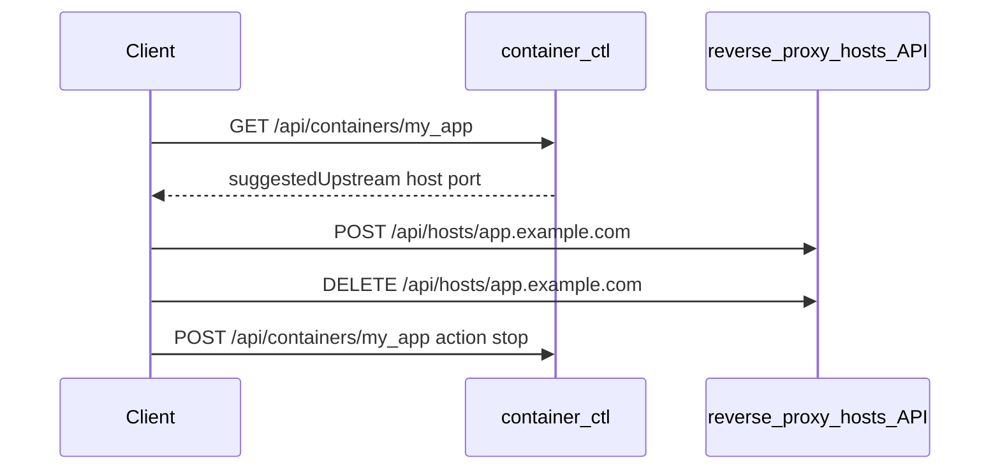

# container-ctl

HTTP API for Docker containers only: list, inspect (with suggested upstream for routing), and lifecycle actions.

Route configuration lives in [reverse-proxy](https://github.com/gsbelarus/reverse-proxy) (`hosts.json` via `/api/hosts`). Call **container-ctl first**, then the proxy hosts API.

## Workflow



### Add a public hostname

1. `GET /api/containers/my_app` — read `suggestedUpstream.host` and `suggestedUpstream.port` (and `ports` / `networks` if needed).
2. `POST https://routes.example.com/api/hosts/app.example.com` on reverse-proxy with body like:

```json
{
  "host": "my_app",
  "port": 3000,
  "protocol": "http:",
  "mode": "http-proxy"
}
```

### Remove a hostname

1. `DELETE` on reverse-proxy hosts API (stop traffic first).
2. `POST /api/containers/my_app` with `{"action":"stop"}` or `{"action":"delete"}` when `CONTAINER_CTL_ALLOW_DELETE=true`.

## API

Auth: `Authorization: Bearer <key>` or `X-API-Key`.

| Method | Path | Description |
|--------|------|-------------|
| `GET` | `/api/containers` | List containers (`id`, `name`, `state`, `statusText`) |
| `GET` | `/api/containers/:name` | Inspect + `suggestedUpstream`, `ports`, `networks` |
| `POST` | `/api/containers/:name` | Body `{"action":"start\|stop\|restart\|delete"}` |

Default listen: `http://0.0.0.0:3080`.

### Inspect example

```json
{
  "id": "abc123",
  "name": "my_app",
  "state": "running",
  "statusText": "running",
  "suggestedUpstream": { "host": "my_app", "port": 3000 },
  "ports": [{ "containerPort": 3000, "hostPort": null, "protocol": "tcp" }],
  "networks": {
    "proxy_network": { "ipAddress": "172.18.0.5", "aliases": ["my_app"] }
  }
}
```

If several ports are exposed, `suggestedUpstream.port` is the first discovered; pick explicitly from `ports` when ambiguous.

## Configuration

| Variable | Description |
|----------|-------------|
| `CONTAINER_CTL_API_KEY` | API key (required) |
| `CONTAINER_CTL_DOCKER_SOCKET` | Docker socket (default `/var/run/docker.sock`) |
| `CONTAINER_CTL_ALLOW_DELETE` | Allow `action: delete` (default `false`) |
| `CONTAINER_CTL_LISTEN_HOST` | Bind address (default `0.0.0.0`) |
| `CONTAINER_CTL_LISTEN_PORT` | Port (default `3080`) |

## Run

```bash
npm install
cp .env.example .env
npm start
```

```bash
docker compose up -d --build
```

Requires external network `proxy_network` (created by reverse-proxy compose). Only `docker.sock` is mounted.

## Tests

```bash
npm test
```

Docker integration: `CONTAINER_CTL_INTEGRATION_DOCKER=1 npm test`
